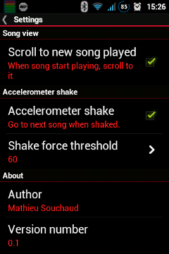

## SicMu Player for Android

Every songs of the phone are put in a unique big song list.

Songs are sorted and grouped by folders, genres, artists, albums and album's track.

Works on old slow small devices (from Android froyo 2.2).

No eye candy graphics.

&nbsp;

### Detailed features
- play mp3, ogg, flac, midi, wav, mp4, 3gp... see Android MediaPlayer Supported Media Formats (depends on android version).
- bluetooth support
- sorted by artists, albums and track number
- or sorted by folders
- show current played song in list
- notification when playing
- seek bar
- shake the phone to go to next song
- disable/enable lockscreen
- on app startup, scroll to last song played

### Help
- press on home button or back button to shut the song list and keep the music playing in background
- press the button to the right of next to scroll the list to current played song
- open the padlock button to disable lock screen (it prevents locking only when the app is on top).

### Todo (perhaps :-)
- the groups can be fold/unfold
- sort folders by artist
- group by genre
- fast on big music list
- guess "smart" track number (2 < 11, song file name vs id tag, ...)
- select main music directory
- quick jump with letter in the right (like in contact)
- zoom make letter (and button) bigger or smaller
- speak the title ?
- cursor for volume ? ( half/full?)
- swipe to go to list of song <-> song details
- mp3 tag editor ?
- help + infobulle ?
- playlist?
- small vibration on action?
- shuffle
- long press on back button kill the app
- go to the last position after automatic scrolling

### Credits

Lot's of time saved thanks to Sue Smith's [tutorials on creating a Music Player on Android](http://code.tutsplus.com/tutorials/create-a-music-player-on-android-project-setup--mobile-22764).

Use some icons done by Daniele De Santis (Creative Commons Attribution 3.0 Unported), found on iconfinder.com.

Seekbar style created by Jérôme Van Der Linden (Creative Commons Attribution 3.0 Unported), found on http://android-holo-colors.com.

### Developer

Compiled with Android Studio.
Robotium non regression tests are available in the androidTest folder.
Tested on Gingerbread (2.3.6), Nexus 4 JellyBean (4.1.2), Samsung S3 (4.3).

### License

Simple Music Player is licensed under the GPLv3. See file LICENSE for more details.

