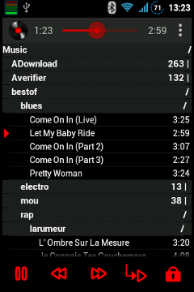

## SicMu Player for Android

Every songs of the phone are put in a unique big song list.

Songs are sorted and grouped by folders, artists, albums and album's track.

Works on old slow small devices (from Android froyo 2.2).

3.5" screen:

&nbsp;

[Video](http://youtu.be/LGyjDfwimzA)

[More screenshots](Screenshots.md)

### Installation

### Detailed features

- sorted by artists, albums and track number
- or sorted by folder tree, useful for big music list
- or sorted by folders, artists, albums and track number, flattening folder hierarchy
- groups can be folded / unfolded
- shake the phone to go to next song
- show current playing song in the list
- notification when playing
- seek bar
- disable / enable lockscreen
- configurable font size
- on app startup, scroll to last song played
- play mp3, ogg, flac, midi, wav, mp4, 3gp... see android mediaplayer supported media formats (depends on android version).
- bluetooth support (play through bluetooth device)
- media buttons support (next, prev, play/pause) from external device (bluetooth headphones...)
- light and fast: starts in 0.5s and uses 10Mo of RAM with 5Go of music (1000 files, 100 folders) on a 700MHz ARM processor.
- support [Simple Last.fm Scrobbler](https://github.com/tgwizard/sls) or [Scrobble Droid](https://code.google.com/p/scrobbledroid) (disabled by default in settings)

### Help

- see help section in app's settings

### Todo (perhaps :-)

- group by genre?
- quick jump with letter in the right (like in contact)?
- search?
- pinned section (upper group level stay at top until another one appears)?
- swipe to go to list of song <-> song details
- mp3 tag editor ?
- playlist?
- audioeffect/equalizer
- turning disc speed follow musics beat

Detailed todo list available in [TODO.txt](misc/TODO.txt).

### Credits

Lot's of time saved thanks to Sue Smith's [tutorials on creating a Music Player on Android](http://code.tutsplus.com/tutorials/create-a-music-player-on-android-project-setup--mobile-22764).

Use some icons done by Daniele De Santis (Creative Commons Attribution 3.0 Unported), found on iconfinder.com.

Seekbar style created by Jérôme Van Der Linden (Creative Commons Attribution 3.0 Unported), found on http://android-holo-colors.com.

RepeatingImageButton.java and MediaButtonIntentReceiver.java file mostly copied from official android music player (Apache License, Version 2.0).

### Developer

Compiled with Android Studio.
Non regression tests are available in the androidTest folder.
Tested on Gingerbread (2.3.6), Nexus 4 JellyBean (4.1.2), Samsung S3 (4.3), Nexus 5 Lollipop (5.0).

Feel free to add GitHub issues (feature request, bugs...).
If you need a feature that is in the todolist, open a feature request on github to speed up its development.

A UML class diagram describe a bit the architecture for people that would want to develop the software [UmlClass.png](misc/UmlClass.png).

SicMu player pronounced zicmu. S is for Super Simple Sorted Souch player.

### Donation

If you don't know what to do with your money or want to make me smile the whole day:
[donate](http://rodolphe.souchaud.free.fr/donate)

### License

SicMu Player is licensed under the GPLv3. See file [LICENSE](LICENSE) for more details.

