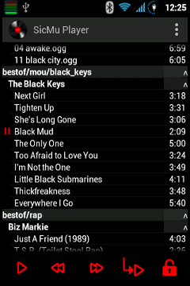
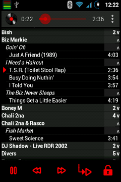
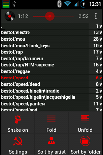

## SicMu Player for Android

Every songs of the phone are put in a unique big song list.

Songs are sorted and grouped by folders, genres, artists, albums and album's track.

Works on old slow small devices (from Android froyo 2.2).

No eye candy graphics.

3.5" screen:

&nbsp;

[More Screenshots](Screenshots.md)

### detailed features

- sorted by artists, albums and track number
- or sorted by folders, artists, albums and track number
- groups can be folded / unfolded
- shake the phone to go to next song
- show current playing song in the list
- notification when playing
- seek bar
- disable / enable lockscreen
- configurable font size
- on app startup, scroll to last song played
- play mp3, ogg, flac, midi, wav, mp4, 3gp... see android mediaplayer supported media formats (depends on android version).
- bluetooth support

### Installation

The SicMu Player is available on [F-Droid](https://f-droid.org/repository/browse/?fdid=souch.smp)

### Help

- see help section inside settings

### Todo (perhaps :-)

- small vibration on action?
- group by genre
- guess "smart" track number (2 < 11, song file name vs id tag, ...)
- quick jump with letter in the right (like in contact)
- speak the title ?
- cursor for volume ? ( half/full?)
- swipe to go to list of song <-> song details
- mp3 tag editor ?
- help + infobulle ?
- playlist?
- pinned section (upper group level stay at top until another one appears)?
- shuffle
- long press on back button kill the app
- button to go to the last position after automatic scrolling
- option: relock on pause even if unlocked
- search?
- benchmark on big music list (> 10Go)
- audioeffect/equalizer  

Detailed todo list available in [TODO.txt](misc/TODO.txt).

### Credits

Lot's of time saved thanks to Sue Smith's [tutorials on creating a Music Player on Android](http://code.tutsplus.com/tutorials/create-a-music-player-on-android-project-setup--mobile-22764).

Use some icons done by Daniele De Santis (Creative Commons Attribution 3.0 Unported), found on iconfinder.com.

Seekbar style created by Jérôme Van Der Linden (Creative Commons Attribution 3.0 Unported), found on http://android-holo-colors.com.

MediaButtonIntentReceiver.java file mostly copied from official android music player (Apache License, Version 2.0).

### Developer

Compiled with Android Studio.
Non regression tests are available in the androidTest folder.
Tested on Gingerbread (2.3.6), Nexus 4 JellyBean (4.1.2), Samsung S3 (4.3), Nexus 5 Lollipop (5.0).

Feel free to add GitHub issues (feature request, bugs...).
If you need a feature that is in the todolist, open a feature request on github to speed up its development.

### Donation

If you don't know what to do with your money or want to make me smile the whole day:
[donate](http://rodolphe.souchaud.free.fr/donate)

### License

SicMu Player is licensed under the GPLv3. See file [LICENSE](LICENSE) for more details.

